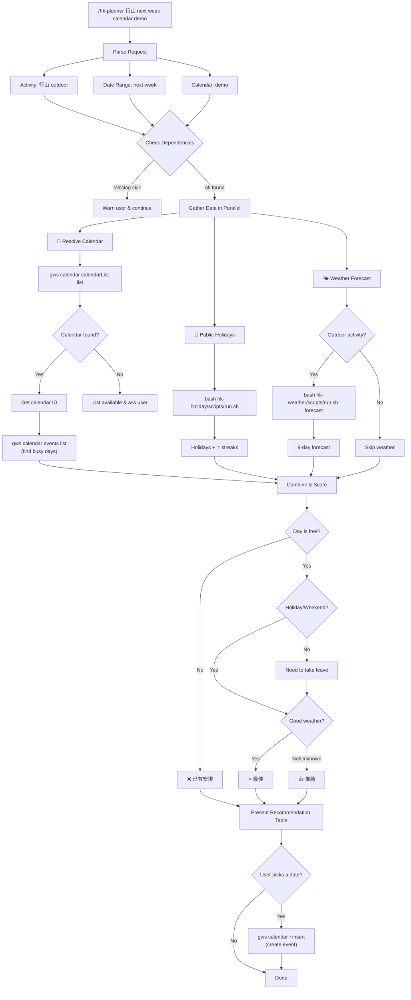

# hk-planner Flowchart

```mermaid
flowchart TD
    A["/hk-planner 行山 next week calendar:demo"] --> B[Parse Request]
    B --> B1[Activity: 行山 outdoor]
    B --> B2[Date Range: next week]
    B --> B3[Calendar: demo]

    B1 & B2 & B3 --> C{Check Dependencies}
    C -->|Missing skill| C1[Warn user & continue]
    C -->|All found| D

    D[Gather Data in Parallel] --> D1[📅 Resolve Calendar]
    D --> D2[🔴 Public Holidays]
    D --> D3[🌤️ Weather Forecast]

    D1 --> D1a["gws calendar calendarList list"]
    D1a --> D1b{Calendar found?}
    D1b -->|Yes| D1c[Get calendar ID]
    D1b -->|No| D1d[List available & ask user]
    D1c --> D1e["gws calendar events list\n(find busy days)"]

    D2 --> D2a["bash hk-holiday/scripts/run.sh"]
    D2a --> D2b[Holidays + ⭐ streaks]

    D3 --> D3a{Outdoor activity?}
    D3a -->|Yes| D3b["bash hk-weather/scripts/run.sh forecast"]
    D3a -->|No| D3c[Skip weather]
    D3b --> D3d[9-day forecast]

    D1e & D2b & D3d & D3c --> E[Combine & Score]

    E --> E1{Day is free?}
    E1 -->|No| E2[❌ 已有安排]
    E1 -->|Yes| E3{Holiday/Weekend?}
    E3 -->|Yes| E4{Good weather?}
    E3 -->|No| E5[Need to take leave]
    E4 -->|Yes| E6[⭐ 最佳]
    E4 -->|No/Unknown| E7[👍 推薦]
    E5 --> E4

    E2 & E6 & E7 --> F[Present Recommendation Table]

    F --> G{User picks a date?}
    G -->|Yes| H["gws calendar +insert\n(create event)"]
    G -->|No| I[Done]
    H --> I
```
